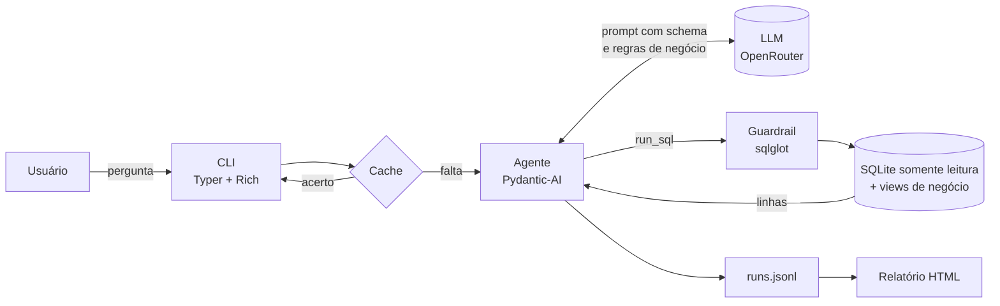
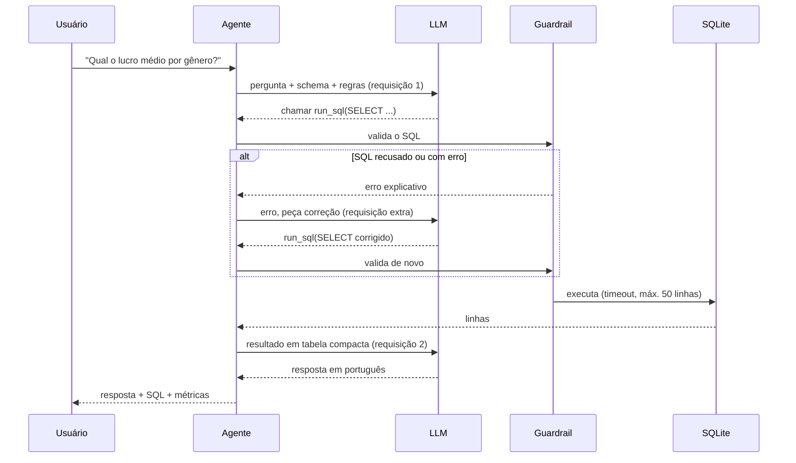

# CineAnalytics Agent

Agente de linha de comando que responde perguntas em linguagem natural sobre o catálogo de filmes da CineAnalytics. Ele traduz cada pergunta em SQL (Text-to-SQL), consulta a camada Gold do Data Lakehouse em modo somente leitura e responde em português, sempre mostrando o SQL executado como evidência.

O objetivo é colocar os dados nas mãos de quem não sabe SQL: analistas de negócio fazem perguntas como "qual gênero tem a maior margem de lucro?" e recebem a resposta com os números, o critério usado e a consulta que a sustenta.

```text
$ cineanalytics ask "Qual o lucro médio por gênero?"
╭─ Resposta ───────────────────────────────────────────────────────────────╮
│                                                                          │
│  Animation tem o maior lucro médio, R$ 812 milhões por filme, seguido    │
│  de Adventure e Science Fiction. Considerei os 1.630 filmes com receita  │
│  e orçamento informados.                                                 │
│                                                                          │
╰──────────────────────────────────────────────────────────────────────────╯
╭─ SQL executado ──────────────────────────────────────────────────────────╮
│ SELECT                                                                   │
│   g.nome_genero,                                                         │
│   ROUND(AVG(f.lucro_brl), 2) AS lucro_medio_brl                          │
│ FROM vw_filmes AS f                                                      │
│ JOIN vw_generos_filme AS g USING (sk_movie_id)                           │
│ WHERE f.lucro_brl IS NOT NULL                                            │
│ GROUP BY g.nome_genero                                                   │
│ ORDER BY lucro_medio_brl DESC                                            │
│ 12 linhas · 88 ms                                                        │
╰──────────────────────────────────────────────────────────────────────────╯
fornecedor/modelo:free · 2 requisições · 4.590 tokens · 6,8 s
```

Projeto desenvolvido para a atividade de GenAI do Rocket Lab 2026 (Visagio).

## Sumário

- [Funcionalidades](#funcionalidades)
- [Stack](#stack)
- [Instalação](#instalação)
- [Configuração](#configuração)
- [Uso rápido](#uso-rápido)
- [Referência de comandos](#referência-de-comandos)
- [Arquivos gerados](#arquivos-gerados)
- [Como funciona](#como-funciona)
- [Os dados que o agente enxerga](#os-dados-que-o-agente-enxerga)
- [Decisões de projeto](#decisões-de-projeto)
- [Avaliação](#avaliação)
- [Testes](#testes)
- [Desenvolvimento](#desenvolvimento)
- [Solução de problemas](#solução-de-problemas)
- [Limitações conhecidas](#limitações-conhecidas)
- [Estrutura do projeto](#estrutura-do-projeto)

---

## Funcionalidades

- **Perguntas em linguagem natural** respondidas com dados reais, nunca inventados. Toda resposta vem de uma consulta ao banco.
- **Transparência:** o SQL executado aparece formatado junto da resposta, assim como as tentativas que o agente precisou corrigir.
- **Modo conversa** com memória: perguntas de acompanhamento como "e no ano anterior?" ou "e só entre os de terror?" usam o contexto anterior.
- **Segurança em quatro camadas:** conexão somente leitura, authorizer do SQLite, validação do SQL com sqlglot e limites de tempo e de linhas.
- **Regras de qualidade de dados** aplicadas em views de negócio, corrigindo problemas reais encontrados na base.
- **Economia da cota gratuita do OpenRouter:** cache de respostas, schema no prompt, limite de chamadas por pergunta e fallback automático entre modelos.
- **Relatório HTML** autocontido, com respostas, gráficos, dados e SQL, que funciona offline e pode ser salvo como PDF.
- **Avaliação automática** contra 14 perguntas de referência, comparando os dados retornados com consultas escritas à mão.
- **130 testes automatizados**, nenhum deles chamando o LLM.

## Stack

| Camada | Tecnologia | Papel |
|---|---|---|
| Linguagem | Python 3.11+ | |
| Agente | [Pydantic-AI](https://ai.pydantic.dev) 2.x | Loop do agente, ferramentas, memória, fallback entre modelos |
| Modelos | [OpenRouter](https://openrouter.ai) | Modelos gratuitos (sufixo `:free`) com suporte a *tool calling* |
| Banco | SQLite (`cinerocket.db`) | Camada Gold com o modelo dimensional |
| Validação de SQL | [sqlglot](https://github.com/tobymao/sqlglot) | Parser usado no guardrail e na formatação do SQL |
| CLI | [Typer](https://typer.tiangolo.com) + [Rich](https://rich.readthedocs.io) | Comandos, painéis, tabelas e realce de sintaxe |
| Configuração | pydantic-settings | Leitura do `.env` com validação |
| Relatório | Jinja2 + markdown-it-py | HTML com gráficos SVG gerados em Python |
| Testes | pytest | Banco sintético e modelo falso do Pydantic-AI |
| Pacotes | [uv](https://docs.astral.sh/uv/) | Ambiente virtual e dependências |

---

## Instalação

### Pré-requisitos

- **Python 3.11 ou superior.** Confira com `python --version`.
- **uv** (recomendado). Instruções em [docs.astral.sh/uv](https://docs.astral.sh/uv/getting-started/installation/). Também é possível usar pip, como mostrado abaixo.
- **Uma chave do OpenRouter.** Crie uma conta gratuita e gere a chave em [openrouter.ai/settings/keys](https://openrouter.ai/settings/keys).
- **O arquivo `cinerocket.db`**, disponível na pasta compartilhada da atividade.

### Passo 1: clonar o repositório

```bash
git clone <url-do-repositorio>
cd CineAnalytics
```

### Passo 2: instalar as dependências

Com uv:

```bash
uv sync
```

O uv cria o ambiente virtual em `.venv/`, instala as dependências (incluindo o pytest) e registra o comando `cineanalytics`. Nos exemplos deste README, os comandos aparecem como `uv run cineanalytics ...`.

<details>
<summary><strong>Alternativa sem uv (pip + venv)</strong></summary>

```bash
python -m venv .venv

# Linux e macOS
source .venv/bin/activate
# Windows (PowerShell)
.venv\Scripts\Activate.ps1
# Windows (cmd)
.venv\Scripts\activate.bat

pip install -e . pytest
```

Com o ambiente ativado, use apenas `cineanalytics ...` no lugar de `uv run cineanalytics ...`.
</details>

### Passo 3: colocar o banco de dados

Copie o `cinerocket.db` para a pasta `data/`. Crie a pasta se ela não existir:

```text
CineAnalytics/
└── data/
    └── cinerocket.db
```

O banco não é versionado (está no `.gitignore`). Ele é aberto em modo somente leitura e nunca é alterado pela aplicação.

### Passo 4: verificar a instalação

```bash
uv run cineanalytics schema
```

Esse comando não usa o LLM nem a chave do OpenRouter. Se ele listar as views e os gêneros, o banco foi encontrado e a instalação está correta.

---

## Configuração

### Criar o `.env`

```bash
cp .env.example .env           # Linux e macOS
copy .env.example .env         # Windows
```

Abra o `.env` e preencha as duas variáveis obrigatórias:

```bash
OPENROUTER_API_KEY=sk-or-v1-...
CINEANALYTICS_MODELS=fornecedor/modelo-a:free,fornecedor/modelo-b:free
```

O `.env` está no `.gitignore` e nunca deve ser versionado, porque contém a sua chave.

### Escolher os modelos

Use modelos **gratuitos** e com suporte a **tool calling**. Este link já aplica os dois filtros:

[openrouter.ai/models?max_price=0&supported_parameters=tools](https://openrouter.ai/models?max_price=0&supported_parameters=tools)

Algumas recomendações:

- **Informe de 2 a 3 modelos**, separados por vírgula. O primeiro é o principal; os seguintes só são usados se o anterior falhar (limite de requisições, erro ou indisponibilidade).
- **Prefira modelos maiores**, que costumam errar menos SQL. Modelos especializados em código também vão bem.
- **A lista de modelos gratuitos muda com frequência.** Se um modelo parar de responder, troque-o no `.env`.

### Todas as variáveis

| Variável | Padrão | Valores aceitos | Descrição |
|---|---|---|---|
| `OPENROUTER_API_KEY` | (obrigatória) | texto | Chave do OpenRouter. Também aceita o nome `CINEANALYTICS_OPENROUTER_API_KEY`. |
| `CINEANALYTICS_MODELS` | (obrigatória) | lista separada por vírgulas | Modelos em ordem de preferência. |
| `CINEANALYTICS_DB_PATH` | `data/cinerocket.db` | caminho | Localização do banco SQLite. |
| `CINEANALYTICS_MAX_ROWS` | `50` | 1 a 500 | Máximo de linhas devolvidas ao modelo por consulta. Valores maiores gastam mais tokens. |
| `CINEANALYTICS_QUERY_TIMEOUT_S` | `10` | maior que 0 | Tempo máximo, em segundos, de uma consulta no SQLite. |
| `CINEANALYTICS_REQUEST_LIMIT` | `6` | 2 ou mais | Teto de chamadas ao LLM por pergunta. Impede que o agente entre em loop e esgote a cota. |
| `CINEANALYTICS_HISTORY_TURNS` | `5` | 0 ou mais | Quantas perguntas anteriores o modo chat lembra. `0` desliga a memória. |
| `CINEANALYTICS_STATE_DIR` | `.cineanalytics` | caminho | Pasta do cache, do histórico de perguntas e dos resultados do eval. |
| `CINEANALYTICS_CACHE_ENABLED` | `true` | `true` ou `false` | Liga ou desliga o cache de respostas. |
| `CINEANALYTICS_REPORTS_DIR` | `reports` | caminho | Pasta onde os relatórios HTML são salvos. |

As variáveis podem ser definidas no `.env` ou diretamente no ambiente, que tem prioridade sobre o arquivo.

Os caminhos relativos (`data/`, `.cineanalytics/`, `reports/` e o próprio `.env`) são resolvidos a partir da **pasta onde o comando é executado**. Rode sempre a partir da raiz do projeto, ou use caminhos absolutos.

---

## Uso rápido

```bash
# Uma pergunta
uv run cineanalytics ask "Quais são os 5 filmes mais populares?"

# Uma conversa com memória
uv run cineanalytics chat

# Relatório HTML das perguntas feitas, aberto no navegador
uv run cineanalytics report --abrir
```

Exemplos de perguntas que o agente responde:

| Categoria | Exemplos |
|---|---|
| Bilheteria e finanças | Top 10 filmes com maior receita em R$; lucro médio por gênero; filmes com maior margem de lucro |
| Popularidade e engajamento | Os 5 filmes mais populares; maior divergência entre nota TMDB e IMDb; nota média IMDb por ano |
| Elenco e equipe | Ator com mais filmes nos últimos 5 anos; diretores com maior nota média (mínimo de 5 filmes); dupla ator–diretor que mais trabalhou junta |
| Gêneros e produtoras | Quantidade de filmes por gênero; produtora com maior lucro total; gênero com maior margem média |
| Avaliações dos usuários | Filmes mais avaliados; filmes em que a nota dos usuários mais diverge do IMDb |

"Receita", "faturamento" e "bilheteria" são tratados como sinônimos.

---

## Referência de comandos

```text
cineanalytics [COMANDO] [OPÇÕES]
```

| Comando | Descrição | Usa o LLM |
|---|---|---|
| [`ask`](#ask) | Faz uma pergunta e mostra a resposta | Sim |
| [`chat`](#chat) | Conversa interativa com memória | Sim |
| [`schema`](#schema) | Mostra os dados disponíveis para o agente | Não |
| [`eval`](#eval) | Avalia o agente nas perguntas de referência | Sim |
| [`report`](#report) | Gera o relatório HTML | Não |
| [`cache info`](#cache) | Mostra o tamanho do cache | Não |
| [`cache clear`](#cache) | Apaga o cache | Não |

Todos os comandos aceitam `--help`, que mostra as opções com os valores padrão. A aplicação também pode ser chamada com `python -m cineanalytics`.

### `ask`

Faz uma única pergunta, mostra a resposta e encerra.

```text
cineanalytics ask "PERGUNTA" [--sql | --sem-sql] [--dados] [--linhas N] [--sem-cache]
```

| Argumento ou flag | Padrão | Descrição |
|---|---|---|
| `PERGUNTA` | (obrigatório) | A pergunta, entre aspas. |
| `--sql` / `--sem-sql` | `--sql` | Mostra ou oculta o painel com o SQL executado. Quando o agente precisou corrigir a consulta, as tentativas recusadas aparecem em amarelo acima do SQL final. |
| `--dados`, `-d` | desligado | Mostra uma tabela com o resultado da consulta final, com valores formatados no padrão brasileiro (R$ 1.234,56; 12,50%). |
| `--linhas N` | `10` | Quantas linhas a tabela de `--dados` exibe. As linhas restantes são indicadas na legenda. |
| `--sem-cache` | desligado | Ignora o cache e chama o modelo novamente. A resposta nova não é gravada no cache, e a anterior continua lá. |

O `ask` não tem memória: cada chamada é independente. Para perguntas de acompanhamento, use o `chat`.

Abaixo da resposta aparece uma linha com o modelo que respondeu, o número de requisições, os tokens e o tempo. Quando a resposta vem do cache, a linha indica "do cache" e "0 requisições".

Exemplos:

```bash
uv run cineanalytics ask "Qual produtora tem o maior lucro total?"
uv run cineanalytics ask "Quantos filmes há por gênero?" --dados --linhas 25
uv run cineanalytics ask "Top 10 filmes por receita" --sem-sql
uv run cineanalytics ask "Diretores com maior nota média, com pelo menos 5 filmes" --sem-cache
```

Código de saída: `0` quando há resposta, `1` quando não foi possível responder (configuração ausente, banco não encontrado, limite de requisições, erro do provedor).

### `chat`

Abre uma conversa interativa. O agente lembra das últimas perguntas (configurável em `CINEANALYTICS_HISTORY_TURNS`), então é possível refinar uma análise aos poucos.

```text
cineanalytics chat [--sem-cache]
```

| Flag | Padrão | Descrição |
|---|---|---|
| `--sem-cache` | desligado | Não lê nem grava o cache durante a conversa. |

Dentro do chat, além das perguntas, estes comandos estão disponíveis:

| Comando | Efeito |
|---|---|
| `/sql` | Alterna a exibição do SQL executado (começa visível). |
| `/dados` | Alterna a exibição da tabela com o resultado (começa oculta). |
| `/limpar` | Apaga a memória da conversa. Útil para mudar de assunto sem que o contexto anterior interfira. |
| `/ajuda` | Mostra a lista de comandos. |
| `/sair` | Encerra o chat. `/exit`, `/quit`, Ctrl+C e Ctrl+D também funcionam. |

Exemplo de conversa:

```text
você: Quais os 5 filmes de terror mais populares?
você: E qual deles teve a maior receita?
você: Quem dirigiu esse filme?
você: /limpar
você: Quantos filmes foram lançados por ano?
```

Sobre o cache no chat: uma resposta só vem do cache quando a conversa ainda não tem contexto, ou seja, na primeira pergunta ou logo após `/limpar`. Uma pergunta como "e no ano anterior?" depende do que veio antes, então nunca é respondida pelo cache.

### `schema`

Mostra as views que o agente pode consultar, com as colunas e suas descrições, a lista de gêneros existentes e o ano de referência. Não usa o LLM, então serve também para conferir se o banco foi encontrado.

```text
cineanalytics schema [--prompt]
```

| Flag | Padrão | Descrição |
|---|---|---|
| `--prompt` | desligado | Mostra o prompt completo enviado ao modelo (instruções, schema, gêneros e regras de negócio) e uma estimativa do tamanho em tokens. Útil para depurar o comportamento do agente. |

```bash
uv run cineanalytics schema
uv run cineanalytics schema --prompt
```

### `eval`

Avalia o agente fazendo as perguntas de referência e comparando os dados retornados com os de consultas escritas à mão. Veja a seção [Avaliação](#avaliação) para os detalhes da comparação.

```text
cineanalytics eval [--id ID ...] [--arquivo CAMINHO] [--sim] [--sem-cache]
```

| Flag | Padrão | Descrição |
|---|---|---|
| `--id ID` | todas | Roda apenas a pergunta com esse ID. Repita a flag para várias: `--id fin_01 --id pop_02`. Um ID inexistente gera erro. |
| `--arquivo CAMINHO` | `evals/questions.yaml` | Arquivo YAML com as perguntas. Permite manter conjuntos de avaliação diferentes. |
| `--sim`, `-y` | desligado | Não pede confirmação antes de gastar requisições. |
| `--sem-cache` | desligado | Ignora o cache e faz todas as perguntas ao modelo de novo, sem gravar as respostas. Use para medir um modelo novo ou uma versão nova do prompt. |

Antes de começar, o comando conta quantas perguntas já estão em cache, mostra uma estimativa de requisições e pede confirmação. Durante a execução, cada resultado aparece assim que fica pronto. No final, são exibidas uma tabela com cada pergunta (correta ou incorreta, com o motivo) e a acurácia por categoria.

```bash
uv run cineanalytics eval --id fin_01 --id fin_02 --id fin_03
uv run cineanalytics eval -y
uv run cineanalytics eval --sem-cache -y
```

O resultado é salvo em `.cineanalytics/evals/eval-AAAAMMDD-HHMMSS.json` e entra no próximo relatório.

**Atenção à cota:** as 14 perguntas sem cache custam de 28 a 40 requisições, quase toda a cota diária gratuita (50). Rode em lotes com `--id` se necessário. Depois que as respostas estão em cache, o eval completo não gasta nenhuma requisição.

### `report`

Gera um relatório HTML com as perguntas feitas pelo `ask` e pelo `chat` e com o resultado do último eval. Não usa o LLM: apenas lê o histórico salvo.

```text
cineanalytics report [--ultimas N] [--desde AAAA-MM-DD] [--avaliacao | --sem-avaliacao] [--saida CAMINHO] [--abrir]
```

| Flag | Padrão | Descrição |
|---|---|---|
| `--ultimas N` | todas | Inclui apenas as N perguntas mais recentes. |
| `--desde AAAA-MM-DD` | sem filtro | Inclui apenas perguntas feitas a partir dessa data. Pode ser combinada com `--ultimas`, que é aplicada depois. |
| `--avaliacao` / `--sem-avaliacao` | `--avaliacao` | Inclui ou omite a seção com o resultado do eval mais recente. |
| `--saida CAMINHO` | `reports/relatorio-AAAAMMDD-HHMMSS.html` | Arquivo de saída. As pastas intermediárias são criadas automaticamente. |
| `--abrir` | desligado | Abre o relatório no navegador padrão depois de gerado. |

```bash
uv run cineanalytics report --abrir
uv run cineanalytics report --ultimas 10
uv run cineanalytics report --desde 2026-10-04 --sem-avaliacao
uv run cineanalytics report --saida docs/relatorio-exemplo.html
```

O relatório contém:

- um resumo com o período, o número de perguntas, respostas, falhas, acertos de cache, requisições, tokens, tempo médio e modelos usados;
- a seção de avaliação, com acurácia por categoria (em gráfico) e o resultado de cada pergunta;
- um índice com links para cada pergunta;
- para cada pergunta: a resposta, um gráfico de barras (quando o resultado tem uma coluna de rótulos e uma numérica), a tabela de dados (até 20 linhas), o SQL executado e as tentativas recusadas.

O arquivo é autocontido: os gráficos são SVG gerados em Python e não há fontes nem scripts externos, então ele abre sem internet. Tem tema claro e escuro (segue a configuração do sistema) e se adapta a telas de celular. Para gerar um PDF, abra o HTML no navegador e use Imprimir → Salvar como PDF; as seções recolhidas se expandem automaticamente na impressão.

Se não houver perguntas nem resultado de eval, o comando avisa e encerra com código `1`.

### `cache`

```text
cineanalytics cache info
cineanalytics cache clear
```

| Subcomando | Descrição |
|---|---|
| `info` | Mostra quantas respostas estão em cache, o espaço ocupado e a pasta. |
| `clear` | Apaga todas as respostas em cache. O histórico de perguntas e os resultados do eval são mantidos. |

Normalmente não é preciso limpar o cache manualmente: ele é invalidado sozinho quando o modelo, as views ou as regras de negócio mudam (veja [Cache de respostas](#cache-de-respostas)).

---

## Arquivos gerados

| Caminho | Conteúdo | Criado por |
|---|---|---|
| `.cineanalytics/cache/*.json` | Uma resposta completa por arquivo (pergunta, resposta, consultas, linhas, tokens) | `ask`, `chat`, `eval` |
| `.cineanalytics/runs.jsonl` | Histórico de todas as perguntas, uma por linha. É a fonte do relatório. | `ask`, `chat` |
| `.cineanalytics/evals/eval-*.json` | Resultado de cada execução do eval | `eval` |
| `reports/relatorio-*.html` | Relatórios HTML | `report` |

Todos estão no `.gitignore`. Para versionar um relatório de exemplo, gere-o fora dessas pastas, por exemplo com `--saida docs/relatorio-exemplo.html`.

---

## Como funciona

### Visão geral



### O caminho de uma pergunta



Uma pergunta típica custa **2 requisições** ao modelo. Cada correção de SQL acrescenta uma. O teto por pergunta é definido por `CINEANALYTICS_REQUEST_LIMIT`.

### O prompt

O prompt enviado ao modelo tem cerca de 2 mil tokens e é montado a partir do banco no momento em que o agente é criado:

1. **Papel e regras de trabalho:** usar sempre a ferramenta `run_sql`, nunca inventar números, uma consulta por chamada, corrigir a partir dos erros, recusar perguntas fora do escopo.
2. **Schema das views:** cada coluna com tipo e descrição, mais duas linhas de exemplo por view.
3. **Gêneros existentes:** a lista real, lida do banco, porque estão em inglês e o usuário pergunta em português.
4. **Regras de negócio** (`src/cineanalytics/prompts/regras_negocio.md`): sinônimos, interpretação de métricas, o ano de referência e o formato da resposta.

Para ver o prompt completo: `cineanalytics schema --prompt`.

### Módulos

| Módulo | Responsabilidade |
|---|---|
| `cli.py` | Comandos Typer e fluxo de cada comando |
| `render.py` | Saída no terminal com Rich e formatação de valores no padrão brasileiro |
| `report.py` + `templates/report.html.j2` | Relatório HTML e gráficos SVG |
| `evaluation.py` | Carregamento do eval e comparação dos resultados |
| `agent.py` | Agente, ferramenta `run_sql`, prompt, memória, cache e tratamento de erros |
| `storage.py` | Cache de respostas e histórico de perguntas |
| `models.py` | `AgentRun` e `QueryLog`, o registro estruturado de cada pergunta |
| `config.py` | Leitura e validação das variáveis de ambiente |
| `guardrails.py` | Validação do SQL gerado pelo modelo |
| `db.py` | Conexão, authorizer, timeout e descrição do schema |
| `views.py` | Views de negócio e regras de qualidade de dados |

As dependências seguem uma direção só, de cima para baixo na tabela, sem ciclos. Cada camada é testada isoladamente.

---

## Os dados que o agente enxerga

O agente não acessa as 10 tabelas brutas da camada Gold. Ele enxerga 5 **views de negócio**, criadas a cada conexão como views temporárias (o arquivo `cinerocket.db` não é alterado). As views já aplicam as regras de qualidade de dados: valores inválidos ou não informados aparecem como `NULL`.

| View | Granularidade | Origem |
|---|---|---|
| `vw_filmes` | Uma linha por filme | `dim_movies` + `fact_movies_performance` + `dim_reviews` |
| `vw_generos_filme` | Uma linha por filme e gênero | `bridge_movie_genre` + `dim_genres` |
| `vw_pessoas_filme` | Uma linha por filme, pessoa e papel | `bridge_movie_person` + `dim_people` |
| `vw_produtoras_filme` | Uma linha por filme e produtora | `bridge_movie_company` + `dim_companies` |
| `vw_reviews` | Uma linha por review escrita | `movie_reviews` |

<details>
<summary><strong>Colunas de <code>vw_filmes</code></strong></summary>

| Coluna | Tipo | Descrição |
|---|---|---|
| `sk_movie_id` | TEXT | Chave do filme, usada para juntar com as outras views |
| `titulo` | TEXT | Título no idioma original |
| `ano_lancamento` | INTEGER | Ano de lançamento (2016 a 2029) |
| `data_lancamento` | TEXT | Data de lançamento (AAAA-MM-DD) |
| `status_filme` | TEXT | 'Lançado', 'Pós-Produção', 'Em Produção' ou 'Planejado' |
| `duracao_minutos` | INTEGER | Duração em minutos |
| `idioma_original` | TEXT | Código do idioma original |
| `sinopse` | TEXT | Sinopse |
| `popularidade` | REAL | Índice de popularidade do TMDB |
| `nota_tmdb` | REAL | Nota TMDB (0 a 10); NULL sem votos |
| `qtd_votos_tmdb` | INTEGER | Votos no TMDB |
| `nota_imdb` | REAL | Nota IMDb (0 a 10); NULL sem votos |
| `qtd_votos_imdb` | INTEGER | Votos no IMDb |
| `nota_media_usuarios` | REAL | Nota média dos usuários da plataforma (0 a 10); NULL sem avaliações |
| `qtd_avaliacoes_usuarios` | INTEGER | Avaliações dos usuários da plataforma |
| `receita_brl` | REAL | Receita em R$; NULL se não informada |
| `orcamento_brl` | REAL | Orçamento em R$; NULL se não informado |
| `lucro_brl` | REAL | Lucro em R$; só existe com receita e orçamento informados |
| `margem_lucro_pct` | REAL | Lucro ÷ receita × 100 |
| `roi_pct` | REAL | Lucro ÷ orçamento × 100 |
| `receita_usd` | REAL | Receita em US$ |
| `orcamento_usd` | REAL | Orçamento em US$ |
| `lucro_usd` | REAL | Lucro em US$ |
</details>

<details>
<summary><strong>Colunas das demais views</strong></summary>

| View | Colunas |
|---|---|
| `vw_generos_filme` | `sk_movie_id`, `nome_genero` (em inglês) |
| `vw_pessoas_filme` | `sk_movie_id`, `sk_person_id`, `nome_pessoa`, `tipo_pessoa` ('Ator', 'Diretor' ou 'Roteirista') |
| `vw_produtoras_filme` | `sk_movie_id`, `sk_company_id`, `nome_produtora` |
| `vw_reviews` | `id_review`, `sk_movie_id`, `autor`, `nota` (0 a 10), `texto`, `criado_em` |
</details>

A definição completa, com o SQL de cada view, está em `src/cineanalytics/views.py`. O comando `cineanalytics schema` mostra as mesmas informações no terminal.

---

## Decisões de projeto

### Diagnóstico da base antes do agente

Antes de escrever o agente, rodei um diagnóstico da camada Gold (`sql/diagnostico.sql`). Ele encontrou problemas que levariam o agente a respostas erradas mesmo escrevendo SQL correto:

| Problema encontrado | Impacto se ignorado | Tratamento |
|---|---|---|
| `lucro_brl` nunca é nulo, mesmo quando falta receita ou orçamento | Lucro igual à receita (sem orçamento) inflaria médias e totais | Lucro, margem e ROI só existem quando receita **e** orçamento são informados |
| Orçamentos de US$ 1 e receitas de US$ 74 | Margens de quase 100% dominariam os rankings | Valores abaixo de US$ 1.000 viram NULL. O corte é em dólar porque o câmbio para real varia de 3,05 a 5,84 entre os filmes |
| ~33 mil filmes com nota TMDB 0 e nenhum voto | Médias de nota artificialmente baixas | Nota sem votos vira NULL |
| Nomes como `0.6`, `100` e `1950s` em `dim_people` (erro de parsing) | "Ator com mais filmes" poderia ser "0.6" | Removidos por padrão, preservando nomes legítimos com dígitos, como "50 Cent" |
| Valores financeiros armazenados como INTEGER | Divisão inteira: margem de 66% viraria 0 | Tudo convertido para REAL |
| Filmes planejados até 2029 | "Últimos 5 anos" viraria 2025 a 2029 | A janela é relativa ao último ano com filmes lançados (2026) |
| Gêneros em inglês, status em português | "Filmes de terror" não encontraria nada | A lista real de gêneros vai no prompt, com exemplos de tradução |
| ~21% dos filmes sem gênero | Totais por gênero não somam o catálogo | O agente menciona isso em análises por gênero |

Uma consequência a destacar: na pergunta "lucro médio por gênero, considerando apenas filmes com receita informada", o agente exige também orçamento informado, porque sem ele o lucro registrado seria igual à receita. O agente explica esse critério na resposta.

### Regras em views, e não só no prompt

As regras de qualidade ficam no banco, e não apenas descritas no prompt. Modelos gratuitos esquecem instruções longas, mas não conseguem contornar uma view: com ela, "dado informado" passa a ser simplesmente `IS NOT NULL`. O prompt fica menor e as consultas ficam mais simples, o que aumenta a taxa de acerto.

As views são temporárias (`CREATE TEMP VIEW`): existem só durante a conexão e funcionam mesmo com o banco aberto em modo somente leitura.

### Segurança em camadas

| Camada | Onde | O que garante |
|---|---|---|
| Conexão `mode=ro` | `db.py` | O arquivo não pode ser alterado, em nenhuma hipótese. |
| Authorizer do SQLite | `db.py` | Depois da criação das views, só leitura é permitida. `INSERT`, `DROP`, `ATTACH` e `PRAGMA` falham mesmo que cheguem ao banco. |
| Guardrail com sqlglot | `guardrails.py` | Exatamente uma consulta `SELECT` ou `WITH`, usando só as views permitidas. Tabelas brutas, `sqlite_master` e funções de tabela são recusadas. |
| Limites | `db.py` | Timeout por consulta e no máximo `CINEANALYTICS_MAX_ROWS` linhas devolvidas ao modelo. |

O guardrail é a camada que produz mensagens úteis: quando recusa uma consulta, explica o motivo ("Tabela 'dim_movies' não disponível. Use apenas: vw_filmes, ...") e o modelo se corrige. O authorizer é a camada que de fato protege o banco: os testes verificam que operações de escrita falham mesmo sem passar pelo guardrail.

### Economia da cota gratuita

A conta gratuita do OpenRouter permite 50 requisições por dia em modelos gratuitos. As medidas abaixo mantêm o custo em cerca de 2 requisições por pergunta:

- **Schema no prompt**, em vez de ferramentas para o modelo explorar o banco. Explorar custaria uma ou duas requisições a mais por pergunta.
- **Resultado em tabela compacta**, e não JSON, com textos longos cortados em 300 caracteres.
- **Cache de respostas** (detalhado abaixo).
- **Teto de requisições por pergunta**, que interrompe o agente se ele entrar em loop.
- **Fallback entre modelos**, que troca de modelo quando o principal atinge o limite, em vez de falhar.
- **Testes sem LLM**, com um modelo falso roteirizado.

### Cache de respostas

Cada resposta bem-sucedida é salva em `.cineanalytics/cache/`. A chave combina três coisas:

- **A pergunta normalizada:** maiúsculas, espaços extras e pontuação final são ignorados, então "Top 10 filmes??" e "top 10 filmes" são a mesma pergunta. Acentos são mantidos.
- **O modelo (ou a lista de fallback):** trocar de modelo gera respostas novas.
- **Um hash do prompt:** mudar as views, o glossário ou os gêneros invalida o cache automaticamente.

Respostas com erro nunca são salvas. Como os dados da camada Gold são estáticos, não há expiração.

### Resposta em texto livre

O agente devolve texto, e não um objeto estruturado. Pedir ao modelo que preencha um schema de saída (resposta, SQL, tipo de gráfico) cria mais uma fonte de falha, e vários modelos gratuitos tropeçam nisso. Os dados estruturados (SQL, linhas, tokens, modelo usado, tentativas recusadas) são coletados pela própria ferramenta `run_sql` e reunidos num `AgentRun`, que alimenta a CLI, o cache, o eval e o relatório.

### Memória da conversa

No `chat`, o agente recebe as últimas `CINEANALYTICS_HISTORY_TURNS` perguntas com as respostas e as consultas. O histórico é sempre cortado no início de uma pergunta, nunca entre uma chamada de ferramenta e o seu resultado, o que faria a API recusar a requisição.

### Tratamento de erros

Nenhum erro chega ao usuário como traceback. Cada caso vira uma mensagem que explica o que fazer:

| Situação | Mensagem |
|---|---|
| Banco não encontrado | Indica o caminho procurado e remete a este README |
| `.env` incompleto | Indica exatamente quais variáveis faltam |
| Limite do OpenRouter (HTTP 429) | Explica o limite diário e sugere aguardar ou trocar de modelo |
| Chave recusada (HTTP 401/403) | Pede para conferir a `OPENROUTER_API_KEY` |
| Teto de requisições atingido | Sugere reformular a pergunta de forma mais específica |
| Consulta lenta | Interrompida após o timeout; o modelo recebe o aviso e simplifica a consulta |

---

## Avaliação

### O conjunto de referência

`evals/questions.yaml` contém as 14 perguntas do enunciado da atividade, distribuídas em cinco categorias. Cada uma tem um SQL de referência escrito à mão sobre as **tabelas brutas**. Assim, o eval testa também as views por um caminho independente.

```yaml
- id: fin_01
  category: bilheteria_financas
  question: "Quais são os 10 filmes com maior receita em R$?"
  check: ordered
  compare_cols: [0]
  sql: |
    SELECT m.titulo, m.ano_lancamento, f.receita_brl
    FROM fact_movies_performance f
    JOIN dim_movies m ON m.sk_movie_id = f.sk_movie_id
    WHERE f.receita_usd >= 1000
    ORDER BY f.receita_brl DESC
    LIMIT 10;
```

| Campo | Descrição |
|---|---|
| `id` | Identificador usado em `--id` |
| `category` | Categoria para o cálculo de acurácia |
| `question` | Pergunta feita ao agente, exatamente como escrita |
| `sql` | Consulta de referência |
| `check` | Como comparar: `ordered`, `set` ou `top1` |
| `compare_cols` | Índices das colunas da referência que precisam aparecer no resultado do agente |
| `notes` | Observações (opcional) |

### Como a comparação funciona

A comparação é feita sobre **os dados**, e não sobre o texto do SQL. O agente pode escrever a consulta como quiser, dar outros nomes às colunas, mudar a ordem delas ou incluir colunas extras. Para cada coluna em `compare_cols`, o avaliador procura uma coluna do agente com os mesmos valores.

| Modo | Usado em | Critério |
|---|---|---|
| `ordered` | Rankings | Mesmos valores na mesma ordem. Se o agente retornar menos linhas que a referência (top 5 em vez de top 10), compara o trecho em comum, com mínimo de 5 linhas. |
| `set` | Agregações (por gênero, por ano) | Mesmo conjunto de linhas, em qualquer ordem. Com várias colunas, os valores também precisam estar associados na mesma linha. |
| `top1` | Perguntas do tipo "qual o maior" | Só a primeira linha precisa coincidir. |

Detalhes adicionais:

- Números são comparados com tolerância de arredondamento (66,67 = 66,6667 = 66,7).
- Textos ignoram maiúsculas e espaços extras.
- Se o agente fizer consultas auxiliares (por exemplo, contar a amostra depois da consulta principal), qualquer consulta bem-sucedida que bata com a referência conta como acerto.

### Resultados

<!-- Preencha com os resultados do `cineanalytics eval` no banco real. -->

| Modelo | Acurácia | Observações |
|---|---|---|
| (preencher) | (x/14) | |

---

## Testes

```bash
uv run pytest            # todos
uv run pytest -q         # resumido
uv run pytest tests/test_guardrails.py -v
```

São 130 testes, e **nenhum chama o OpenRouter**. Eles usam:

- **Um banco SQLite sintético** (`tests/conftest.py`), montado com o DDL real da camada Gold e com dados que reproduzem os problemas encontrados no diagnóstico: nomes inválidos, orçamento de US$ 1, filmes planejados para 2029, notas zero sem votos.
- **Um modelo falso roteirizado** (`tests/helpers.py`), baseado no `FunctionModel` do Pydantic-AI, que devolve SQLs e respostas predefinidos.

| Arquivo | O que cobre |
|---|---|
| `test_guardrails.py` | Consultas aceitas e recusadas (escrita, múltiplos statements, tabelas brutas, PRAGMA, ATTACH, funções de tabela) |
| `test_db.py` | Modo somente leitura, authorizer, timeout, truncamento, uso a partir de threads, regras das views, documentação das colunas |
| `test_eval_references.py` | SQLs de referência sobre as tabelas brutas comparados com consultas equivalentes sobre as views |
| `test_agent.py` | Fluxo completo, correção de SQL após erro, limite de requisições, rate limit, memória e corte do histórico |
| `test_storage.py` | Normalização e chave do cache, invalidação, uso do cache com e sem contexto, histórico |
| `test_evaluation.py` | Regras de comparação e o eval de ponta a ponta |
| `test_report.py` | Conteúdo do relatório, escape de HTML vindo do LLM, gráficos, filtros do comando |
| `test_cli.py` | Todos os comandos, mensagens de erro e comandos internos do chat |

---

## Desenvolvimento

### Usar o agente a partir do Python

O agente pode ser usado num script ou notebook, sem a CLI:

```python
from cineanalytics.agent import CineAgent, build_model
from cineanalytics.config import Settings
from cineanalytics.db import Database
from cineanalytics.storage import ResponseCache

settings = Settings()
api_key, models = settings.require_llm()

with Database(settings.db_path) as db:
    agent = CineAgent(db, build_model(models, api_key), cache=ResponseCache(settings.cache_dir))

    run = agent.ask("Quais são os 5 filmes mais populares?")
    print(run.resposta or run.erro)

    final = run.consulta_final          # última consulta bem-sucedida
    print(final.sql)
    print(final.columns, final.rows)
    print(run.modelo, run.requisicoes, run.tokens_entrada + run.tokens_saida)
```

`agent.ask()` mantém a memória entre chamadas; use `remember=False` para uma pergunta avulsa e `agent.reset()` para limpar o contexto.

### Adicionar perguntas ao eval

Acrescente uma entrada em `evals/questions.yaml` seguindo o formato da seção [Avaliação](#avaliação). Escreva o SQL de referência sobre as tabelas brutas e confira que ele executa:

```bash
uv run pytest tests/test_eval_references.py
uv run cineanalytics eval --id nova_pergunta
```

### Mudar uma regra de negócio

- **Regra de dados** (o que conta como válido, como calcular uma métrica): edite a view em `src/cineanalytics/views.py`. Ao incluir ou renomear colunas, atualize também a lista `columns` da view; um teste garante que as duas ficam sincronizadas.
- **Regra de interpretação** (sinônimos, formato de resposta): edite `src/cineanalytics/prompts/regras_negocio.md`. O marcador `{ano_referencia}` é substituído pelo ano calculado a partir do banco.

Nos dois casos, o cache é invalidado automaticamente, porque o prompt muda.

### Diagnóstico da base

`sql/diagnostico.sql` reúne as consultas usadas para encontrar os problemas de qualidade. Elas podem ser executadas com qualquer cliente SQLite, como o [DB Browser for SQLite](https://sqlitebrowser.org).

---

## Solução de problemas

| Sintoma | Causa provável | Solução |
|---|---|---|
| `Banco não encontrado em 'data/cinerocket.db'` | O arquivo não está em `data/`, ou o comando foi executado de outra pasta | Coloque o banco em `data/` e rode a partir da raiz do projeto, ou defina `CINEANALYTICS_DB_PATH` com um caminho absoluto |
| `Configuração ausente: OPENROUTER_API_KEY, CINEANALYTICS_MODELS` | `.env` inexistente, incompleto ou fora da pasta atual | Crie o `.env` a partir do `.env.example` na raiz do projeto |
| `cineanalytics: command not found` | Ambiente virtual não ativado | Use `uv run cineanalytics ...` ou ative o `.venv` |
| `Limite de requisições do OpenRouter atingido` | Cota diária (50) ou limite por minuto esgotado | Aguarde, informe mais modelos em `CINEANALYTICS_MODELS` ou use perguntas já em cache |
| `A chave do OpenRouter foi recusada` | Chave errada, revogada ou com espaços | Gere uma nova chave e confira o `.env` |
| `Falha ao chamar o modelo` mencionando *tool use* ou *endpoint* | O modelo não suporta tool calling, ou saiu do ar | Escolha outro modelo pelo link da seção [Configuração](#escolher-os-modelos) |
| `O agente usou o limite de 6 chamadas` | O modelo não conseguiu montar uma consulta válida | Reformule a pergunta de forma mais específica, troque de modelo ou aumente `CINEANALYTICS_REQUEST_LIMIT` |
| A resposta diz que não encontrou o filme | Título traduzido (os títulos estão no idioma original) | Use o título original, geralmente em inglês |
| Acentos ou bordas aparecem quebrados no Windows | Terminal antigo sem UTF-8 | Use o Windows Terminal, ou defina `PYTHONIOENCODING=utf-8` |
| Uma resposta antiga continua aparecendo | A pergunta está em cache | Use `--sem-cache` para ver uma resposta nova, ou `cineanalytics cache clear` para substituir as antigas |

Para entender por que o agente respondeu algo, rode a pergunta com `--dados` para ver o resultado bruto e confira o SQL. Para ver exatamente o que o modelo recebe, use `cineanalytics schema --prompt`.

---

## Limitações conhecidas

- **Títulos no idioma original.** Uma pergunta com o título traduzido ("O Chamado") pode não encontrar o filme. O agente avisa e pede o título original.
- **Câmbio variável.** Os valores em reais usam o câmbio da época de cada filme, o que afeta comparações entre anos. O agente menciona isso quando é relevante, e as colunas em dólar estão disponíveis.
- **Amostras pequenas.** Só cerca de 1,6 mil dos 95 mil filmes têm lucro calculável. O agente informa o tamanho da amostra nas respostas financeiras.
- **Rankings por nota sem mínimo de votos.** Seguindo as perguntas do enunciado, não há mínimo de votos por padrão. Quando o topo é dominado por filmes com poucos votos, o agente avisa e oferece refazer a consulta com um mínimo.
- **Dependência do modelo.** Modelos gratuitos variam em qualidade e disponibilidade, e o resultado do eval depende do modelo escolhido.
- **Sem interface gráfica.** A interação é pelo terminal; o relatório HTML é a forma de compartilhar resultados.

---

## Estrutura do projeto

```text
CineAnalytics/
├── .env.example                    # modelo de configuração
├── .gitignore
├── pyproject.toml                  # dependências e comando cineanalytics
├── README.md
├── data/                           # cinerocket.db (não versionado)
├── evals/
│   └── questions.yaml              # 14 perguntas de referência
├── sql/
│   └── diagnostico.sql             # diagnóstico de qualidade da base
├── src/cineanalytics/
│   ├── __main__.py                 # python -m cineanalytics
│   ├── cli.py                      # comandos
│   ├── render.py                   # saída no terminal
│   ├── report.py                   # relatório HTML
│   ├── evaluation.py               # avaliação
│   ├── agent.py                    # agente
│   ├── storage.py                  # cache e histórico
│   ├── models.py                   # AgentRun e QueryLog
│   ├── config.py                   # variáveis de ambiente
│   ├── guardrails.py               # validação de SQL
│   ├── db.py                       # acesso ao banco
│   ├── views.py                    # views de negócio
│   ├── prompts/
│   │   └── regras_negocio.md       # regras injetadas no prompt
│   └── templates/
│       └── report.html.j2          # template do relatório
└── tests/
    ├── conftest.py                 # banco sintético
    ├── helpers.py                  # modelo falso
    ├── fixtures/schema.sql         # DDL da camada Gold
    └── test_*.py                   # 130 testes
```